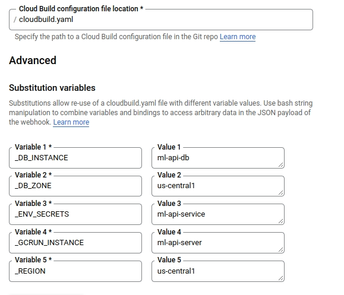
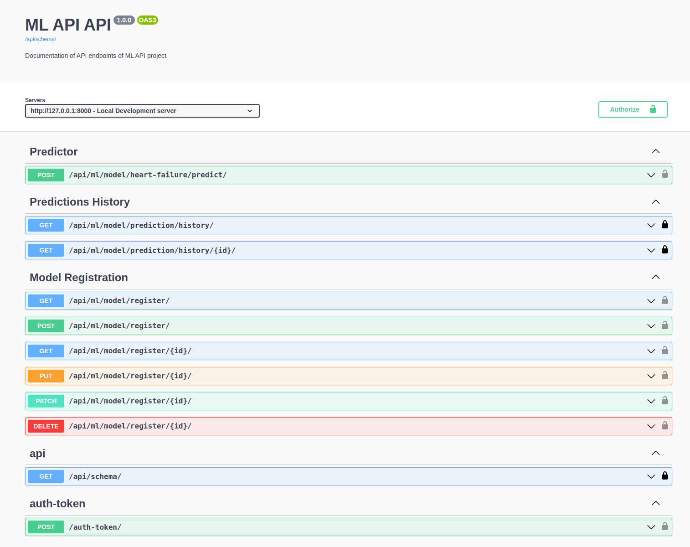
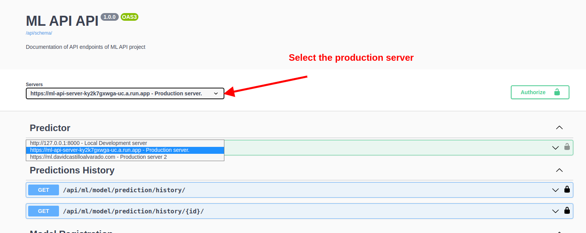
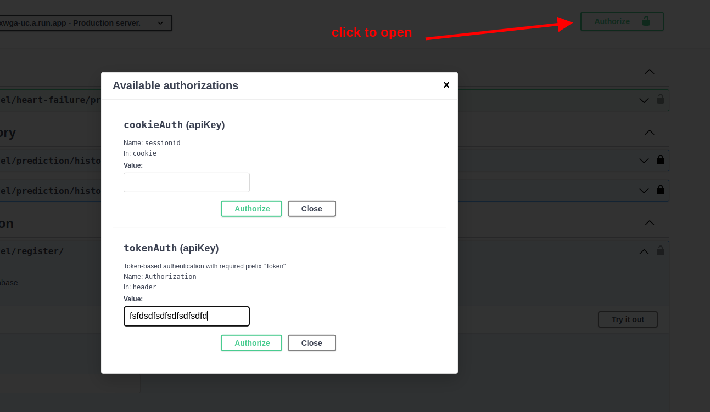
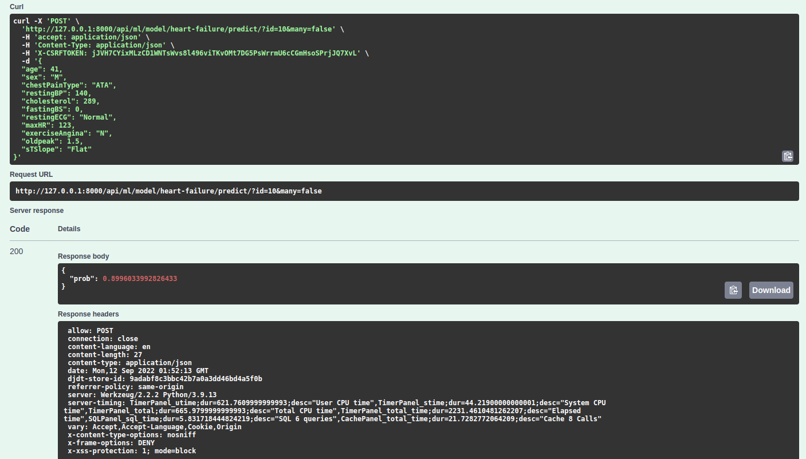

# Machine Learning API

ML API is a probe of concept about how to deploy a simple ml model on cloud.

License: MIT

## Settings

Moved to [settings](http://cookiecutter-django.readthedocs.io/en/latest/settings.html).

## Basic Commands to quickstart

_______________

#### 1. Build Docker compose

```
sudo docker-compose -f local.yml build
```

#### 2. Up Docker compose

```
sudo docker-compose -f local.yml up
```

#### 3. Makemigrations db changes

```
sudo docker-compose -f local.yml run --rm django python manage.py makemigrations
```

#### 4. Migrate db changes

```
sudo docker-compose -f local.yml run --rm django python manage.py migrate
```

#### 5. Create superuser

```
sudo docker-compose -f local.yml run --rm django python manage.py createsuperuser
```

#### 6. Run test

```
sudo docker-compose -f local.yml run --rm django pytest
```

#### Before commit please use pre-commit to check your code. [Link_docs](https://pre-commit.com/#install)

```
pre-commit run --all-files
```

## Recomendation

-------------

### Create a Sentry account

Sentry is an error logging aggregator service. You can sign up for a free account at <https://sentry.io/signup/?code=cookiecutter> or download and host it yourself.
The system is set up with reasonable defaults, including 404 logging and integration with the WSGI application.

You must set the DSN url in production.

### Integrate Github with cloudbuild

To increase productivity please integrate the github with cloudbuild in google cloud platform ecosistem. [see more on GCP docs](https://cloud.google.com/build/docs/automating-builds/github/build-repos-from-github)

## Deployment

________________

The following details how to deploy this application.

### Docker

See detailed [cookiecutter-django Docker documentation](http://cookiecutter-django.readthedocs.io/en/latest/deployment-with-docker.html).

## Deployment on GCP

### Integrate Redis to the project

1. Create an Redis instance on GCP ::

   ```bash
   gcloud redis instances create ml-api-rediscache --region us-central1
   ```

1. Create an VPC connector (serverless vpc access) for cloudrun, using the same region that redis instance ::

   ```bash
   gcloud compute networks vpc-access connectors \
   create mlapiconnectorvpc \
   --network default \
   --region us-central1 \
   --range 10.8.0.0/28
   ```

1. Create a bucket on GCP
1. Create a cloud Postgresql database
1. Create a secret on GCP secret manager (.env.example)
1. Create a cloudbuild trigger on GCP (example)



### Create super user with production database

1. Please refer to [this page](https://cloud.google.com/python/django/flexible-environment) to see the details.

        1.1. create a secure connection
        1.2. update your .env with the new connection (optional)
        1.3. create a superuser with the docker-compose command above


# Usage

1. The project has its own api schema with extence documention.

```
http://127.0.0.1:8000/api/docs/
```


2. Select the right server in this dropdown field. If you ar working in develop then use the 127.0.0.1 but if you are in production use the right one. 



3. Put your user-token in the authorization handler. Or create your own using the api `/auth-token/`


### 1. `Predictor` (more information about schemas in the webpage schema):
To perform prediction using the selected model in the parameter id which is the id model.
- You can send one or multiples records at the same time, usign the flag many true/false
- If you are in many true mode, then your input must be a list of jsons records.

### 2. `Prediction History` (more information about schemas in the webpage schema):

List the history of a model o model base on filters.
- algorithm name
- version
- order by creation date

### 3. `Model Registration `(more information about schemas in the webpage schema):

Create new models, and ensure that your blob URLs will be available to the server IAM control.

You can create/update/list/retrieve the models that you want.


# Kaggle Notebook

Please go to this link in kaggle and run all the notebook. [Notebook-link](https://fdsfs.com)

1. (Add-ons) create a secret in the notebook

```
API_ML_AUTH_TOKEN="your-user-auth-token-from-your-server"
API_DOMAIN="your-server-domain"
ID_PROJECT="your-id-gcp-project"
```
2. (Add-ons) Activate the google cloud service with your project to grant access with the bucket

3. After you run successfully you can perform a prediction in from the server using the model **id**

   3.1. You can search for the last model and get the id using the endpoint
   ```
   GET
   http://127.0.0.1:8000/api/ml/model/register/?ordering=-created_at
   ```
   3.2. After you obtain the model id you can use the id to call the predictor, you can perform a single but also multi records at the same time.
   ```
   POST
   data as json
   http://127.0.0.1:8000/api/ml/model/heart-failure/predict/?id=10&many=false
   ```

   
